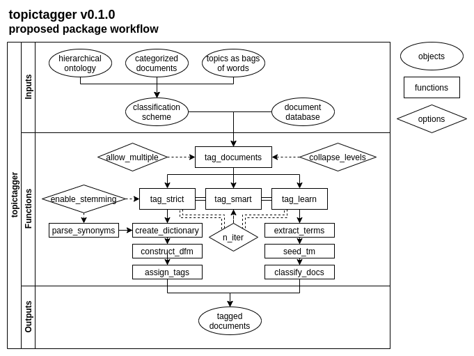

topictagger 
==================

Extracting and tagging metadata for evidence synthesis takes an average of 25.3 days for systematic maps [(Haddaway and Westgate 2018)](https://doi.org/10.1111/cobi.13231). Since many types of metadata, such as location of study or focal species, also function as eligibility criteria to include studies in a synthesis, the total amount of time spent considering metadata for a systematic map could be upwards of 100 hours. topictagger partially automates the process of tagging metadata and document topics for evidence synthesis. Given a hierarchical ontology of relationships between entitites, a set of articles with known topics, or a set of terms associated with a topic, topictagger will tag metadata from an ontology or classify articles by probable topics (e.g. outcomes) and return probable topics and metadata tags for each article. 

